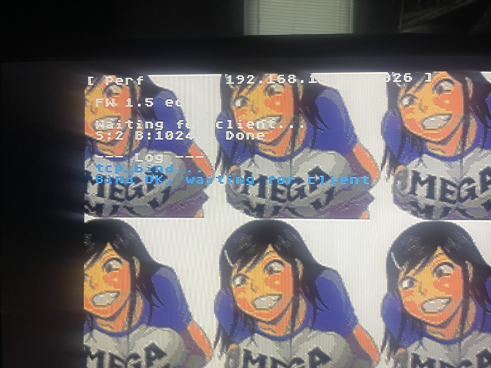
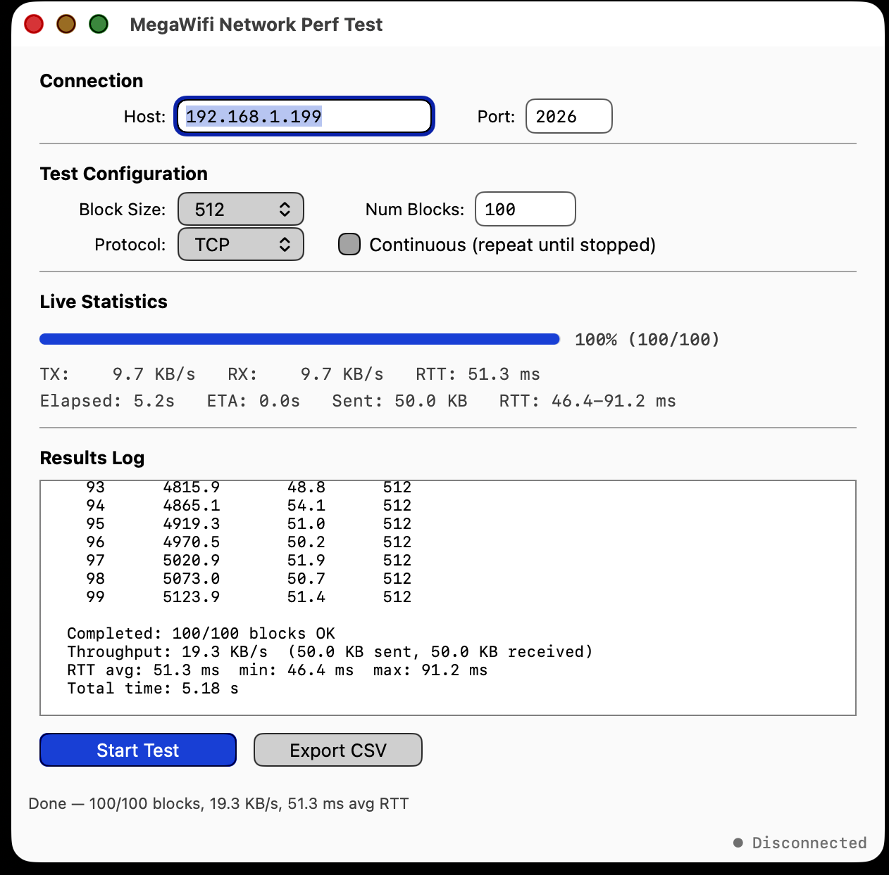

# MegaWifi Network Performance Test Suite

```
  ┌──────────────────────────┐         TCP/2026         ┌──────────────────────────┐
  │   macOS Client App       │◄═══════════════════════►  │   Sega Genesis Server    │
  │   (Objective-C / Cocoa)  │    echo blocks + timing   │   (m68k / SGDK)          │
  │                          │                           │                          │
  │  ┌────────────────────┐  │                           │  ┌────────────────────┐  │
  │  │ [Throughput|Latency]│  │                           │  │ BG_A: Text overlay │  │
  │  │                    │  │                           │  │   Title / IP:port  │  │
  │  │ Throughput:        │  │                           │  │   FW version       │  │
  │  │  Block size/count  │  │                           │  │   Server state     │  │
  │  │  TX/RX KB/s, ETA   │  │                           │  │   Session stats    │  │
  │  │                    │  │                           │  │   Scrolling log    │  │
  │  │ Latency:           │  │                           │  ├────────────────────┤  │
  │  │  Payload/ping count│  │                           │  │ BG_B: girl.png     │  │
  │  │  RTT ms + VBlanks  │  │                           │  │  diagonal scroll   │  │
  │  └────────────────────┘  │                           │  │  +1X +1Y / VBlank  │  │
  └──────────────────────────┘                           │  │                    │  │
                                                         │  └────────────────────┘  │
                                                         │          MegaWifi        │
                                                         │        ESP32-C3 ─── WiFi │
                                                         └──────────────────────────┘
```

Measures TCP throughput and round-trip latency between a macOS client and a
Sega Genesis running the MegaWifi ESP32-C3 WiFi cartridge.

**Measured on real hardware (100-ping average, 4-byte payload):**

| Metric              | Value                                        |
|---------------------|----------------------------------------------|
| Throughput (TX+RX)  | ~11.6 KB/s each direction at 1460-byte blocks |
| Round-trip latency  | 11.1 ms avg (8.7 ms min, 28.0 ms max)        |
| VBlank frames / RTT | 0.7 avg (0.5 min, 1.7 max)                   |
| Jitter (std dev)    | 2.4 ms                                        |

A single LSD message round-trip completes well within one VBlank frame
(16.67 ms at 60 Hz), making the serial interface suitable for real-time
co-processor offload (crypto, math, JSON parsing) with sub-frame response.

| Genesis Server | macOS Client |
|:-:|:-:|
|  |  |

---

## Quick Start

```bash
# 1. Build & flash Genesis server
cd md/
make                        # → out/perf_server.bin
# Flash to MegaWifi cartridge via mdma / wflash

# 2. Build & run macOS client
cd mac-app/
make run                    # builds + launches MegaWifiPerf.app

# 3. Enter the IP shown on the Genesis screen, click Start Test
```

---

## Components

### `md/` — Genesis Echo Server (m68k, SGDK)

A TCP echo server that runs on the Sega Genesis with a MegaWifi cartridge.
It binds to port 2026, waits for a client, performs a 4-byte handshake to
agree on block size and count, then echoes every block back byte-for-byte.

The display shows real-time diagnostics on BG_A (title, IP, firmware version,
server state, session stats, scrolling log) with a tiled, diagonally scrolling
background image on BG_B.

**Build requirements:**
- [SGDK](https://github.com/Stephane-D/SGDK) at `~/sgdk`
- `m68k-elf-gcc` in PATH

**Key files:**
```
md/
├── Makefile
└── src/
    ├── config.h         # MW_BUFLEN=1460, MODULE_MEGAWIFI=1
    ├── girl_gfx.h       # Generated tile data (128×128, 14-colour, 210 tiles)
    ├── megawifi.c        # Local MegaWifi API with draw hook + timeout fixes
    └── perf_server.c     # Echo server + VDP display + background scroll
```

### `mac-app/` — macOS Performance Client (Objective-C, Cocoa)

A native macOS GUI application built with plain Objective-C and Cocoa — no
Xcode project, no NIBs, just a Makefile and source files.

The app has two tabs, modelled after the MegaWifi MDMA programmer interface:

**Throughput tab:**
- Configurable block size (64–1460), block count, continuous mode
- Live statistics: TX/RX KB/s, round-trip time, elapsed/ETA, progress bar
- Per-block timing log with CSV export

**Latency tab:**
- Configurable payload size (4–1460 bytes) and ping count
- Per-ping RTT in milliseconds and VBlank frames (÷ 16.67 ms)
- Summary statistics: min / avg / max RTT, jitter (standard deviation)
- CSV export of all ping results

**Common features:**
- Connection panel with host/port (remembers last IP via NSUserDefaults)
- Non-blocking TCP connect with `select()` timeout
- 500 ms post-connect delay for Genesis server compatibility
- Shared status bar with connection indicator and cancel button
- SceneKit rotating-cube About window
- DMG distribution target (`make dmg`)

**Build requirements:**
- Xcode Command Line Tools (no external dependencies)

**Key files:**
```
mac-app/
├── Makefile
├── mega.png                 # App icon source image
├── Resources/
│   ├── AppIcon.icns         # Generated from mega.png (all sizes)
│   └── Info.plist
└── src/
    ├── main.m               # Manual NSApplication bootstrap (no NIB)
    ├── AppDelegate.{h,m}    # Menu bar, window creation
    ├── MainWindowController.{h,m}       # Tabbed window + shared status bar
    ├── PerfTestViewController.{h,m}     # Throughput test tab
    ├── LatencyTestViewController.{h,m}  # Latency ping test tab
    ├── AboutWindowController.{h,m}      # SceneKit cube About window
    └── me_floyd_png.{h,c}              # PNG decoder for cube texture
```

---

## Protocol

Raw TCP echo with a 4-byte big-endian handshake on port 2026:

```
  Client                              Genesis
    │                                    │
    │──── TCP connect ──────────────────►│
    │                                    │
    │          (500 ms delay)            │
    │                                    │
    │──── [blk_sz:u16][num:u16] ───────►│  Handshake (4 bytes)
    │◄─── [blk_sz:u16][num:u16] ────────│  ACK
    │                                    │
    │──── block[0] (blk_sz bytes) ─────►│  Echo loop
    │◄─── block[0] (blk_sz bytes) ──────│
    │──── block[1] ────────────────────►│
    │◄─── block[1] ─────────────────────│
    │         ...                        │
    │──── block[N-1] ──────────────────►│
    │◄─── block[N-1] ───────────────────│
    │                                    │
    │──── TCP close ────────────────────►│
    │                                    │
```

---

## Engineering Notes

### The 500 ms Client Delay (Handshake Race Condition)

The MegaWifi LSD protocol multiplexes data channels and control commands
over a single serial link.  When polling socket status with
`mw_sock_conn_wait()`, the internal `mw_command()` function discards any
data that arrives on channel 1 because the `cmd_data_cb` callback is never
set (see megawifi.c line 68: `// TODO This callback is never set!`).

If the client sends the handshake immediately after TCP connect, the 4
bytes arrive while the Genesis is still inside `mw_sock_conn_wait()` →
`mw_command()` silently eats them → the subsequent `mw_recv_sync()` never
sees the handshake and times out.

**Workaround:** The client waits 500 ms after `connect()` returns before
sending the handshake.  This gives the Genesis time to exit
`mw_sock_conn_wait()` and arm `mw_recv_sync()` on channel 1.

### Non-Blocking Connect with `select()`

macOS `SO_RCVTIMEO` / `SO_SNDTIMEO` do not apply to `connect()`.  The
client uses `O_NONBLOCK` + `select()` with a timeout to implement a
proper connect timeout, then restores blocking mode before data transfer.

### Smooth Background Scrolling on Genesis

Getting pixel-perfect diagonal scrolling on BG_B while the server blocks on
network I/O required solving several problems:

#### Problem 1: Pattern Must Divide the Nametable

The Genesis VDP nametable is 64×32 tiles.  The scroll registers wrap at
512 px (H) and 256 px (V).  If the tile pattern dimensions don't divide
evenly into the nametable, scrolling produces a visible seam at the wrap
boundary.

The source image (93×100 px) was resized to **128×128 px (16×16 tiles)**:
- 64 ÷ 16 = 4 reps horizontally  ✓
- 32 ÷ 16 = 2 reps vertically    ✓

#### Problem 2: Index 0 Is Always Transparent

On the Genesis, pixel index 0 in any tile is transparent regardless of
the palette colour stored there.  Any content pixel that lands on index 0
appears as a black hole.

**Fix:** Quantize to 14 colours and shift all pixel indices by +1, so
content uses indices 1–14.  Index 0 is never written to a tile.  Index 15
is reserved for overlay text colour.

#### Problem 3: Draw Hook Must Fire Every Frame

The MegaWifi API functions `mw_recv_sync()`, `mw_send_sync()`, and
`mw_sock_conn_wait()` block the main task by calling `TSK_superPend()`
with the full timeout.  During this pend, the draw hook never fires, so
any VDP work driven by the hook (background scroll) stalls completely.

The internal `mw_command()` function already solves this — it pends
**1 frame at a time** and calls the draw hook after each frame:

```c
do {
    tout = TSK_superPend(1);
    if (mw_draw_hook) mw_draw_hook();
    frames_left--;
} while (tout && frames_left > 0);
```

**Fix:** Apply the same 1-frame-at-a-time pattern to `mw_recv_sync()`,
`mw_send_sync()`, and `mw_sock_conn_wait()` in the local `megawifi.c`.
This keeps the draw hook firing every frame during all blocking operations
without changing the external API or timeout semantics.

#### Problem 4: Scroll Position Must Be Frame-Locked

The draw hook fires from `mw_process()` in the user task, which may
execute multiple times per frame or skip frames entirely.  Using an
incremental counter (`bg_sx++`) produces choppy or accelerated scrolling.

**Fix:** Derive the scroll position from `vtimer` (SGDK's VBlank frame
counter, which increments exactly once per hardware VBlank):

```c
bg_sx = (s16)(vtimer & 0x1FF);   /* wrap at 512 px */
bg_sy = (s16)(vtimer & 0xFF);    /* wrap at 256 px */
```

A guard `if (frame == last_frame) return;` prevents duplicate updates
within the same frame.  The result is exactly +1 pixel per VBlank in
both axes, regardless of when or how often the hook fires.

#### Problem 5: `SYS_setVBlankCallback` Does Not Work Here

SGDK's `SYS_setVBlankCallback()` fires from `SYS_doVBlankProcess()`,
which is called by `VDP_waitVSync()` — **not** by the hardware VBlank
interrupt.  During `TSK_superPend()` blocking, `VDP_waitVSync()` is never
called, so the callback never fires.

`SYS_setVIntCallback()` fires from the hardware interrupt but must not
touch the VDP (conflicts with SGDK's DMA queue processing).

**The correct approach** is the draw hook + modified megawifi.c described
above.

#### Problem 6: `mw_sock_conn_wait` Timeout Bug

The upstream `mw_sock_conn_wait()` subtracted `MW_STAT_POLL_MS` (250)
from a frame counter instead of `MW_STAT_POLL_TOUT` (~15 frames), making
timeouts **17× shorter** than intended.  Fixed in the local copy and
pushed upstream (stock_ticker commit `19d8dce`).

### Round-Trip Latency and the VBlank Budget

The full echo path for a single message traverses:

```
  macOS  →  WiFi  →  ESP32-C3  →  LSD serial  →  Genesis (m68k)
  macOS  ←  WiFi  ←  ESP32-C3  ←  LSD serial  ←  Genesis (m68k)
```

Measured with a 4-byte payload over 100 pings on real hardware:

| Statistic     | RTT (ms) | VBlank frames |
|---------------|----------|---------------|
| Minimum       |      8.7 |           0.5 |
| Average       |     11.1 |           0.7 |
| Maximum       |     28.0 |           1.7 |
| Jitter (σ)    |      2.4 |           0.1 |

The average round-trip fits comfortably within a single VBlank frame
(16.67 ms at 60 Hz NTSC).  Outliers beyond one frame are attributable to
WiFi retransmissions or ESP32 TCP stack scheduling — the LSD serial
interface itself operates well below the frame budget.

**Throughput ceiling analysis:** At 11.1 ms average RTT with synchronous
send/recv, the protocol can sustain ~90 round-trips per second.  At the
maximum 1460-byte block size: `90 × 1460 = ~128 KB/s` theoretical
bidirectional.  The observed ~11.6 KB/s per direction (~23.2 KB/s total)
indicates that the synchronous echo loop — which serialises
send→recv→send→recv — is the primary bottleneck, not the raw serial
bandwidth (1.5 Mbaud ≈ 187 KB/s).

**Implications for co-processor offload:** Sub-frame latency means the
Genesis can issue a command to the ESP32-C3 (e.g., AES encrypt, SHA hash,
float math) and receive the result within the same VBlank frame, enabling
real-time cryptographic and computational offload without visible stalls.

### Socket Teardown After Client Disconnect

After `mw_close()`, the ESP32 lwIP TCP stack may hold the socket in
`TIME_WAIT` for several seconds.  Polling `mw_sock_stat_get()` in a loop
immediately after close sends repeated commands over the LSD serial link
while the channel is being torn down, which corrupts the protocol state
and prevents rebinding.

**Fix:** Use a fixed 3-second delay after `mw_close()` instead of status
polling.  This gives the TCP stack sufficient time to release the socket
without interfering with the LSD command channel.

### TILE_ATTR_FULL — rescomp Tilemap Pitfall

When using SGDK's `rescomp` IMAGE resources, the generated tilemap
contains **bare tile indices** (0, 1, 2…).  The `map_base` parameter in
the `.res` file is documentation only — it is NOT baked into the data.

Writing bare indices directly to the VDP nametable produces scrambled
colours because every tile defaults to PAL0 and the wrong VRAM offset.
You must apply `TILE_ATTR_FULL(palette, priority, flipV, flipH,
TILE_USER_INDEX + idx)` yourself when filling the nametable.

This project generates tile data as C arrays (bypassing rescomp), but the
lesson applies to any SGDK project using tiled backgrounds.

---

## Configuration

| Parameter      | Default            | Location         |
|----------------|--------------------|--------------------|
| WiFi SSID      | (MegaWifi Slot 0)  | `perf_server.c`  |
| WiFi Password  | (MegaWifi Slot 0)  | `perf_server.c`  |
| TCP Port       | 2026               | Both             |
| MW_BUFLEN      | 1460               | `config.h`       |
| Block timeout  | 10 s               | `perf_server.c`  |
| Connect wait   | 5 min              | `perf_server.c`  |
| Connect delay  | 500 ms             | `PerfTestVC.m`   |

---

## License

Part of the [MegaWifi](https://github.com/doragasu/mw) project.
